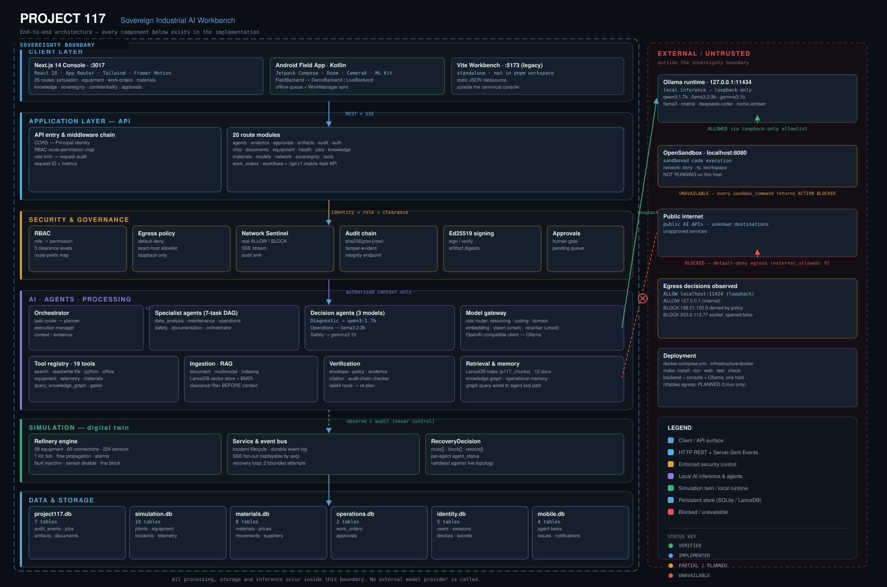

# Project 117

**"Sovereign Industrial Intelligence"**

Project 117 is an on-premise industrial AI system built around a simulated
refinery. A plant event — a failed transmitter, a tripped machine, a blocked
process line — is detected by a deterministic simulation engine, handed to a
pipeline of agents, decided by three locally served language models, checked
against a plant validator, executed against the live topology, verified, and
recorded to an audit trail. Every model, database row, retrieved document and
log line stays on the machine.

The console was built as a Smart India Hackathon (SIH) demonstration build
(`apps/web/src/lib/role.tsx`).

**Verified in this tree at the time of writing:** 368 backend tests pass
(`pytest tests/`); `tsc --noEmit` is clean; `next lint` reports 0 errors and 3
hook-dependency warnings; `next build` succeeds across 28 routes. `ruff` and
`pyright` are **not** clean — see [Project Status](#project-status).

---

## What Project 117 Is

Project 117 is three things that share one plant model and one event log:

1. **A deterministic digital twin of a refinery** — 58 equipment items, 60
   process connections, 224 sensors and 18 process areas, modelled as a tick
   engine. It carries real geometry, real topology and declared failure modes.
   Nothing about it is a rendering: the engine computes equipment state, line
   flow, sensor quality and alarms from the connection graph on every tick.

2. **A model-driven incident pipeline** — an incident is decomposed into a task
   DAG, investigated with tools and retrieved evidence, and turned into a
   recovery decision by three local Ollama models (Diagnostic, Operations,
   Safety). The models choose real connection IDs; the engine executes exactly
   the IDs the plant validator accepted, or it executes nothing.

3. **A materials and business-intelligence layer** — 25 materials, 6 suppliers,
   inventory balances, movements, production output, price history and
   equipment-to-spare requirements, all joined to the same plant asset IDs.
   Every number is computed in Python from stored rows; no model does
   arithmetic.

The system does not require the internet. Local models (Ollama or any
OpenAI-compatible server), local retrieval (LanceDB), local SQLite stores and a
local sandbox client are the whole dependency set.

---

## Core Capabilities

| Capability | What is actually implemented |
|---|---|
| Plant simulation | Deterministic tick engine over a committed refinery and steelworks dataset; fault injection, sensor disable/remove, line block/leak/restore, plant reset. |
| Live event stream | Server-Sent Events at `GET /api/simulation/plants/{id}/stream`, replayable from a sequence number. The console renders events; it does not invent them. |
| Multi-agent investigation | A 7-task incident DAG (orchestrator classification, data analysis, maintenance, operations, safety, documentation, plan synthesis) with tools, evidence and citations per task. |
| Model-driven recovery | Three agents (`diagnostic`, `operations`, `safety`) each call a real local model and return strict JSON; the merged decision carries `route[]`, `block[]`, `restore[]`, `safety_confirmed` and per-agent `agent_status`. |
| Plant-backed validation | The decision is rejected unless the route is ordered topology, avoids blocked lines, and starts or ends inside the incident circuit. |
| Verification | Independent checkers run after the action; a failed verification hands the route back to the agents once and then escalates to the operator. |
| Approvals | Every execute/external-risk action is parked for a human decision before the handler runs. |
| Materials intelligence | Deterministic equipment → requirement → coverage → price → cost → procurement-proposal chain, exposed to agents as read-only tools. |
| Persistence and audit | SQLite for the simulation, operations and materials stores; every pipeline stage writes an audit row before/independently of the SSE frame. |
| Retrieval | Hybrid LanceDB index over the committed document corpus, with an in-repo lexical BM25 fallback and citations on every chunk. |
| Console | Next.js 14 App Router console: simulation, equipment, work orders, approvals, documents, knowledge graph, materials, history, insights, admin. |
| Field application | Native Android client (`apps/mobile`, Kotlin + Jetpack Compose + Room): QR/barcode scanning, CameraX evidence capture, offline queue with background sync, agent tasks, supervisor approvals and role permissions, behind a `FieldBackend` abstraction with `DemoBackend` (in-process) and `LiveBackend` (API) implementations. |

---

## Architecture

Project 117 includes two complementary architecture diagrams:
1. **High-Level System & Enterprise Architecture**: The operational blueprint illustrating user personas (Web Dashboard & Field Mobile), enterprise data sources, the on-prem AI engine, and zero-egress security boundaries.
2. **Technical Subsystem & Implementation Architecture**: The concrete code-level subsystem wiring, showing exact ports, API routes, agent DAGs, verification checkers, and deterministic simulation layers.

---

### 1. System & Enterprise Architecture (High-Level)


This operational blueprint illustrates the complete industrial loop:
* **Client Touchpoints**: On-prem Web Dashboard (`apps/web`, Next.js 14) for plant engineers/operators and Native Android Field App (`apps/mobile`, Kotlin + Compose + Room) for field technicians with QR/barcode scanning, CameraX evidence capture, and offline background sync.
* **Enterprise Data Sources**: Air-gapped connectors to ERP (SAP), CMMS (Maximo), DCS/SCADA Historians, SOP/manual document stores, and real-time IoT sensor telemetry.
* **On-Premise AI Engine**: An Orchestrator supervising specialized agents (Maintenance, Operations, Documentation, Data Analysis, Safety & Compliance), backed by an organizational memory layer (Graph, Vector, Episodic), tool execution sandboxes, and local model routers.
* **Sovereign Boundary**: Complete zero-egress air-gapping, encrypted local storage, role-based access control (RBAC), and immutable audit logs.

---

### 2. Technical Subsystem & Implementation Architecture (Code-Level)



This technical architecture maps every implemented component, port, and subsystem:
* **Client Layer**: Next.js 14 Console (`:3017`, 26 routes), Android Field App (Kotlin, Room, WorkManager, Live/Demo backends), and legacy Vite Workbench (`:5173`).
* **Application Layer**: FastAPI backend (`:8000`, REST + SSE), security middleware chain (CORS, Principal identity, RBAC permission map, rate limiting, request audit), and 20 route modules.
* **Security & Governance**: Default-deny network egress policy, Network Sentinel (live ALLOW/BLOCK streaming), tamper-evident SHA-256 audit chain (`sha256(prev || row)`), Ed25519 artifact cryptographic signatures, and human-in-the-loop approval queues.
* **AI & Agent Processing**: 7-task incident DAG orchestrator, 3-model simulation recovery agents (`qwen3:1.7b`, `llama3.2:3b`, `gemma3:1b`), Model Gateway, 19 registered tools, and 5 independent verification checkers (artifact, calculation, citation, evidence, hallucination).
* **Data & Simulation Layers**: Deterministic digital twin tick engine (58 equipment, 60 lines, 224 sensors, 18 areas) with plant-backed topology validation; SQLite stores for simulation, operations, and materials; and LanceDB hybrid vector retrieval.

---

### 3. Subsystem Communication Map

```
┌──────────────────────────────────────────────────────────────────────────┐
│ Browser — apps/web (Next.js 14 App Router, :3017)                        │
│   /console/simulation · equipment · work-orders · approvals · materials  │
│   live adapter: REST + SSE          embedded adapter: explicit mock only │
│                                                                          │
│ Field — apps/mobile (Kotlin · Jetpack Compose · Room, standalone Gradle) │
│   FieldBackend → DemoBackend (offline) | LiveBackend (Project 117 API)   │
│   CameraX · ML Kit scanning · WorkManager sync · role permissions        │
└───────────────────────────────┬──────────────────────────────────────────┘
                                │ REST + Server-Sent Events
┌───────────────────────────────▼──────────────────────────────────────────┐
│ Backend API — backend/api/src (FastAPI, :8000)                           │
│   routes/ simulation/ middleware/ (CORS, audit, rate limit, errors)      │
└───────┬───────────────────────────────┬──────────────────────────────────┘
        │                               │
        ▼                               ▼
┌───────────────────────┐   ┌──────────────────────────────────────────────┐
│ Simulation engine     │   │ Orchestrator — backend/orchestrator          │
│ backend/simulation    │   │  task router → planner → execution manager   │
│  engine, service,     │   │  context manager (evidence + memory)         │
│  decision, agents,    │   │  approvals · verification manager            │
│  persistence (SQLite) │   └───────┬──────────────┬───────────────┬───────┘
└──────────┬────────────┘           │              │               │
           │                        ▼              ▼               ▼
           │            ┌────────────────┐ ┌──────────────┐ ┌──────────────┐
           │            │ Agent registry │ │ Tool registry│ │ Verification │
           │            │ backend/agents │ │ backend/tools│ │ checkers     │
           │            │ 5 specialists  │ │ 19 tools     │ │ artifact,    │
           │            └───────┬────────┘ └──────┬───────┘ │ calculation, │
           │                    │                 │         │ citation,    │
           │                    ▼                 │         │ evidence,    │
           │            ┌────────────────┐        │         │ hallucination│
           │            │ Model gateway  │        │         └──────────────┘
           │            │ backend/models │        │
           │            └───────┬────────┘        │
           │                    ▼                 │
           │            ┌────────────────┐        │
           │            │ Ollama :11434  │        │
           │            │ qwen3:1.7b     │        │
           │            │ llama3.2:3b    │        │
           │            │ gemma3:1b      │        │
           │            └────────────────┘        │
           │                                      ▼
           │            ┌────────────────┐ ┌──────────────┐ ┌──────────────┐
           └───────────▶│ Retrieval      │ │ Memory       │ │ Security     │
                        │ backend/rag +  │ │ backend/     │ │ egress guard │
                        │ LanceDB, or    │ │ memory (in   │ │ RBAC,        │
                        │ lexical BM25   │ │ ContextMgr)  │ │ approvals,   │
                        └────────────────┘ └──────────────┘ │ audit,       │
                                                            │ secrets      │
                                                            └──────────────┘
```

The three simulation decision agents are invoked from
`backend/simulation/decision.py` on the approval decision: Diagnostic and
Operations run concurrently (`asyncio.gather`), then Safety runs on the proposed
route. Findings (`response.failover_completed`,
`response.root_cause_identified`, `response.prediction`) are emitted only after
that decision exists.

---

## AI Agents

### Simulation decision agents

Three agents, one real local model each. The per-agent model is resolved with
this precedence (`backend/simulation/decision.py`):

1. per-agent override — `P117_DIAGNOSTIC_MODEL` / `P117_OPERATIONS_MODEL` /
   `P117_SAFETY_MODEL`;
2. shared fallback — `P117_DECISION_MODEL`;
3. role bucket — `P117_REASONING_MODEL` (diagnostic, operations) /
   `P117_DOMAIN_MODEL` (safety).

| Agent | Role | Model in `.env.example` | Responsibility |
|---|---|---|---|
| **Diagnostic** | `diagnostic` | `qwen3:1.7b` | Which assets are affected, and why; names a declared failure mode when the equipment declares one. |
| **Operations** | `operations` | `llama3.2:3b` | Chooses the recovery route as ordered connection IDs: `route`, `block`, `restore`. |
| **Safety** | `safety` | `gemma3:1b` | Accepts or rejects the proposed route against the safety facts; returns `safe` and `concerns`. |

Execution properties (`backend/simulation/decision.py`): `temperature=0`,
strict-JSON system prompts, `think=false` and `num_ctx=4096` sent to Ollama,
reply budget `P117_DECISION_MAX_TOKENS` (2048) with a 2048-token reasoning
floor. Diagnostic and Operations share no inputs and run concurrently; Safety
needs the Operations route and runs after it.

### Incident pipeline tasks

An incident is decomposed into seven tasks (`backend/simulation/agents.py`),
each with tools, evidence and status:

| # | Agent | Task |
|---|---|---|
| 1 | `orchestrator` | Classify incident and decompose into agent tasks |
| 2 | `data_analysis` | Validate the failure against related measurements |
| 3 | `maintenance` | Evaluate failure mode and replacement requirement |
| 4 | `operations` | Evaluate process continuity on degraded instrumentation |
| 5 | `safety` | Check the safe-operating envelope |
| 6 | `documentation` | Retrieve governing procedures (with citations) |
| 7 | `orchestrator` | Synthesize the response plan |

### Specialist agent registry

`backend/agents/` registers five specialists used by the orchestrator path:
`maintenance`, `operations`, `documentation`, `data_analysis`, `safety`
(`GET /api/agents`). They receive their model router, tool registry and context
pack by dependency injection; they do not build their own clients.

---

## Sensor Failure → Recovery Workflow

The flow is genuinely event-driven from backend events. The console advances on
the SSE stream and never on a timer. The exact sequence observed from the
running service for a sensor failure:

1. **Operator action** — `POST /api/simulation/plants/{id}/sensors/{sensor_id}/disable`
   (the console's "out of service" control) or a fault injection
   (`.../equipment/{id}/failure` with `mode_id: sensor_failure`).
2. **`sensor.disabled`** — the transmitter is marked failed: value frozen,
   quality bad.
3. **Isolation** — the affected section is taken out of service in the engine;
   the schematic draws it red and flow stops.
4. **`incident.created`** → **`response.perception`** → **`incident.updated`** —
   the incident carries the origin asset, sensor, severity and the department
   resolved from the asset's own process area.
5. **`agent.started`** — explicit handoff to `operations` and `diagnostics`,
   carrying the runtime label and the roster.
6. **Lane start beats** — `response.lane_started` (×2),
   `response.operations_notified`, `response.failover_evaluating` (real
   candidate topology reads, not a conclusion).
7. **Task DAG** — `agent.task_started` / `agent.tool_completed` /
   `agent.evidence_found` / `agent.task_completed` for the seven tasks.
8. **`approval.required`** — the plan is parked. The console grants the approval
   automatically once the tasks have been dispatched (the API is
   `POST /api/simulation/plants/{id}/incidents/{incident_id}/decision`); the
   plant page guards this per incident so it fires once.
9. **Three real model turns** — `response.decision` is emitted with
   `available`, `model`, `diagnosis`, `route[]`, `block[]`, `restore[]`,
   `safety_confirmed`, `safety_concerns[]`, `rationale` and per-agent
   `agent_status` (`completed` / `rejected` / `failed` / `skipped`).
10. **Findings, only now** — `response.failover_completed`,
    `response.history_reviewed`, `response.root_cause_identified`,
    `response.prediction`, `response.user_notified`. The tests pin the ordering:
    every finding has a higher sequence number than `response.decision`.
11. **If the decision is available and valid** — `action.started` →
    `action.completed` → `verification.started` → `verification.completed` →
    `artifact.created` → `incident.resolved` → `audit.recorded`. The engine
    executes exactly the connection IDs the agents chose.
12. **If it is not** —
    * a model that cannot answer produces `available=false` and the incident
      stays open; the UI shows a **LOCAL MODEL UNAVAILABLE** banner naming the
      failing agent;
    * a route the plant validator rejects produces `RECOVERY DECISION INVALID`
      or `SAFETY CHECK FAILED`, with the validator's own findings;
    * no action executes, no recovery is reported, and the plant is left
      untouched;
    * after `RECOVERY_ATTEMPTS = 2` failed verification passes the incident is
      escalated (`recovery.escalated`) instead of sitting open forever.

The recovery loop is bounded: a route that fails the engine's own verification
is handed back to the same three agents once with the route they already tried
and the real findings, then the incident escalates.

---

## Simulation

**Datasets** (`project-117-simulation/database/seed_plants.sql`, applied to
SQLite on first run):

| Plant | ID | Equipment | Connections | Sensors | Zones | Scenarios |
|---|---|---:|---:|---:|---:|---:|
| Meridian Synthetic Refinery | `refinery` | 58 | 60 | 224 | 18 | 14 |
| Kalinga Synthetic Steelworks | `steel` | 55 | 58 | 194 | 17 | 14 |

The refinery is the demo dataset; the steelworks exercises the same engine and
agent pipeline on a different topology.

**EDIT MODE — the builder** (`/console/simulation/builder`). An editable canvas:
units can be dragged, snapped to a 20-unit grid and wired port-to-port; pan and
zoom are enabled. It starts from a blank canvas or a template, validates the
graph with a BFS/DFS circuit check, and can save the plant to the backend
(`POST /api/simulation/plants`) or load it back from the database. A
session-local "Saved" library keeps one instrumented unit or one relation.
The hub labels this surface **Design mode**.

**LIVE MODE — the running plant** (`/console/simulation/plant/{id}`). The
process map is drawn from the dataset's own geometry: 18 area rectangles with
real x/y/w/h, unit positions, and 60 pipes carrying medium, capacity, flow,
status, leaking and enabled. It is **fixed-camera**: `fixedCamera` locks the
view to one full-plant framing, so wheel, trackpad, pinch and drag do not move
it, while equipment and lines stay clickable. Editing surfaces leave the lock
off.

**State semantics.** In live mode the engine lives in the backend process for
the life of that process. Operator changes are session-scoped: the console
resets the plant on load (`POST /api/simulation/plants/{id}/reset`) so a reload
finds the pristine definition. Client-side navigation between console pages
keeps the session; only a reload discards it. Persisted simulation state
(incidents, tasks, evidence, approvals, actions, verifications, artifacts,
audit rows, telemetry) goes to `data/simulation.db`.

Endpoints: `GET /api/simulation/plants`, `.../plants/{id}/definition`,
`.../plants/{id}/scenarios`, `.../plants/{id}/snapshot`, `.../plants/{id}/frame`,
`.../plants/{id}/stream`, `.../plants/{id}/history`, `.../incidents/{id}/record`,
`.../audit`, plus control routes for start/pause/reset, fault injection, sensor
disable/remove/restore and line block/restore/leak.

---

## Materials Intelligence

The materials domain is joined to the same plant asset IDs as the simulation:
the 11 equipment IDs that carry requirements resolve against real refinery
equipment. The chain is:

```
equipment asset (e-P-1042)
  → equipment_material_requirements        required quantity, schedule, failure mode
  → material_requirement                   surplus = available − required − safety_stock
                                           COVERED / SHORTFALL per line
  → inventory balances + movements         quantity − reserved = available (computed once)
  → price history                          latest price, window change, NORMAL/WARNING/ABNORMAL
  → financial_impact                       quantity × unit price, with unit re-basing
  → procurement_recommendation             PENDING_APPROVAL, proposed order quantity, cost
  → procurement request                    parked in the approvals queue; nothing is ordered
```

Stored rows (this tree): **25 materials** (2 raw material, 8 intermediate, 3
finished product, 12 maintenance spare), **6 suppliers**, **4,270 price
observations**, **190 movements**, **25 inventory balances**, **543 production
rows**, **12 equipment requirements**, **30 financial events**.

Every record carries `Provenance`, and the API returns `data_status` on every
payload. Every record and response is marked `SYNTHETIC_DEMO` with source
`PROJECT117-SYNTHETIC-DEMO` (see the disclaimer below).

Three properties are enforced in `backend/materials/service.py`:

* **Limitations are values, not exceptions.** Missing data returns a structured
  code (`INVENTORY_DATA_UNAVAILABLE`, `PRICE_HISTORY_UNAVAILABLE`,
  `CONVERSION_BASIS_REQUIRED`, `MAINTENANCE_REQUIREMENT_NOT_FOUND`, …) rather
  than a substitute number.
* **Derived values carry their method.** A cost carries
  `quantity × unit_price` plus its `calculation_status` (`ILLUSTRATIVE`).
* **Confidence is a function of evidence**, computed from sample counts and
  dispersion, and drops when evidence is thin.

Agents reach this layer only through ten read-only tools
(`RiskLevel.READ`): `get_material`, `get_inventory_status`,
`get_material_movements`, `get_production_output`,
`get_equipment_material_requirements`, `get_maintenance_requirements`,
`search_price_history`, `calculate_material_requirement`, `forecast_inventory`,
`generate_procurement_recommendation`. No tool writes, orders or approves; the
procurement request endpoint raises a *pending* approval and is idempotent per
equipment.

---

## Security / Sovereignty

Only what the code actually enforces:

| Control | Implementation |
|---|---|
| **On-prem local models** | One OpenAI-compatible endpoint (`P117_LLM_BASE_URL`, default `http://localhost:11434/v1`). Every model role is unconfigured by default; an unconfigured role returns `503 model_unavailable` naming the variable, and never silently picks a model. A Hugging Face repo id (`org/name`) is rejected at startup unless `P117_ALLOW_REMOTE_MODEL_REPOS=true`. |
| **Enforced zero egress** | `P117_EGRESS_DEFAULT_DENY=true`. `EgressGuardTransport` wraps every `httpx` request, including redirects and streams, and checks the policy before the request leaves (`backend/security/egress.py`). `localhost`, `127.0.0.1` and `::1` are always reachable; other hosts require an explicit exact-host entry in `P117_EGRESS_ALLOWED_HOSTS`. In this tree `GET /health` reports `egress: denied` and 0 external calls allowed. |
| **RBAC** | Four roles — `viewer`, `analyst`, `operator`, `admin` — mapped to the permissions tools declare. With `P117_AUTH_REQUIRED=false` an unauthenticated request is treated as `operator`, never `admin`. With auth required, `X-P117-Api-Key`, `X-P117-User` and `X-P117-Roles` identify the caller. |
| **Approvals** | Approval is derived from declared tool risk: `read`/`compute`/`write` run automatically; `execute` and `external` are gated before the handler runs. `P117_TOOL_MAX_RISK` caps what any plan may invoke. |
| **Tool gates** | `ToolRegistry.execute` passes five gates in order: existence, schema validation, authorisation, approval, resource limits. Every outcome, including refusals, writes a row and an audit event; arguments are redacted before persistence. |
| **Audit** | Every pipeline stage and sensitive operation writes an audit event; `detail` is passed through secret redaction and never carries raw document contents. `P117_AUDIT_HTTP=true` also records mutating HTTP requests. |
| **Secret redaction** | `P117_DATABASE_PASSWORD`, `P117_MODEL_API_KEY`, `P117_CONNECTOR_SAP_PASSWORD`, `P117_CONNECTOR_CMMS_TOKEN`, `P117_CONNECTOR_DMS_TOKEN`, `P117_CONNECTOR_HISTORIAN_TOKEN` are redacted from logs and audit detail by name. |
| **Isolated execution** | Model-authored code runs through the sandbox client (`backend/sandbox/`), never on the host. Images are chosen by the policy, not by the caller; CPU/memory/time/output limits are set; `P117_SANDBOX_ALLOW_NETWORK=false` by default and enabling network without an API key refuses to start. |
| **Connectors** | SAP/CMMS/DMS/historian/generic connectors are disabled by default and read-only; none writes back to a source system. |
| **On-prem data** | Documents, uploads, LanceDB vectors, SQLite databases and audit rows all live under `data/`. |

Honest scope: the egress guard covers HTTP made by this process through
`httpx`. Vendored code that opens its own sockets and container-level egress
control are not covered. Auth is off by default for a single-workstation
install; turn it on before exposing the service beyond `127.0.0.1`.

---

## Technology Stack

| Layer | Technology | Version |
|---|---|---|
| Backend runtime | Python | `requires-python >= 3.11`; reference virtualenv 3.14.2 |
| Backend framework | FastAPI | 0.141.1 |
| ASGI server | uvicorn | 0.52.4 |
| Validation / settings | pydantic / pydantic-settings | 2.13.5 / 2.15.0 |
| ORM | SQLAlchemy | 2.0.52 |
| Vector / FTS store | LanceDB | 0.38.0 |
| HTTP client | httpx | 0.28.1 |
| Ingestion | Docling | 2.126.0 |
| Numerics | numpy / pyarrow | 2.x / >= 15 |
| Test / quality | pytest 9.1.1, pytest-asyncio 1.4.0, ruff 0.16.6, pyright 1.1.411 | dev group |
| Console framework | Next.js (App Router) | 14.2.35 |
| UI | React / TypeScript / Tailwind CSS | 18.3.1 / 5.6.3 / 3.4.x |
| 3D + motion + charts | three 0.169.0, @react-three/fiber 8.x, framer-motion 11.x, recharts 2.13.x | — |
| Package manager | pnpm (`packageManager`) | 9.15.0 |
| Node | Node.js | 22.23.1 in this tree; >= 20 documented |
| Vite workbench | Vite / React Flow / react-router-dom | 5.4.x / 11.11.x / 6.26.x |
| Local inference | Ollama | `qwen3:1.7b`, `llama3.2:3b`, `gemma3:1b` |

Ports read from code: backend **8000** (`backend/config.py`), Next.js console
**3017** (`apps/web/package.json`), Vite workbench **5173**
(`frontend/vite.config.ts`). The backend CORS default allows
`http://{127.0.0.1,localhost}:{3017,3000}`.

---

## Project Structure

```
project117/
├── apps/web/                    Next.js 14 console + landing page          :3017
│   ├── src/app/                 App Router: /, /console/*, /dashboard, /workbench
│   ├── src/components/          console shell, sim canvas, recovery view, landing
│   └── src/lib/sim/             live (REST+SSE) ⇄ embedded (mock) adapters
│
├── backend/                     FastAPI engine                             :8000
│   ├── api/src/                 app factory, routes, middleware, schemas
│   ├── simulation/              engine, service, decision, agents, persistence, SSE
│   ├── orchestrator/            task router, planner, execution, verification manager
│   ├── agents/                  maintenance, operations, documentation,
│   │                            data_analysis, safety
│   ├── tools/                   registry + builtin, materials, files, office, python
│   ├── materials/               domain models, seed, deterministic service, units
│   ├── models/                  gateway, router, providers, role modules
│   ├── rag/  ingestion/         hybrid retrieval over LanceDB + citations
│   ├── memory/                  organisational memory (semantic, episodic, procedural)
│   ├── verification/            artifact, calculation, citation, evidence,
│   │                            hallucination, policy checkers + verifier
│   ├── security/                egress, rbac, approvals, auth, audit, secrets,
│   │                            network monitor, sandbox policy
│   ├── sandbox/                 OpenSandbox client + policy
│   ├── connectors/              SAP, CMMS, DMS, historian, generic (disabled by default)
│   ├── deliverables/            PDF/DOCX/PPTX/XLSX generators + spec
│   ├── workflows/               YAML workflow engine
│   ├── jobs/  chat/  graph/  storage/  observability/
│   └── config.py  logging_config.py
│
├── frontend/                    Standalone Vite + React workbench          :5173
│   └── src/                     React Flow canvas, agent trace, WS bridge
│
├── project-117-simulation/      Plant data package (source of truth)
│   ├── database/seed_plants.sql committed SQL seed (refinery + steel + scenarios)
│   └── public/                  frozen JSON exports for the Vite workbench
│
├── data/                        runtime + dataset data (see data/README.md)
│   ├── corpus/refinery/         8 committed source documents (PDF/DOCX/PPTX/XLSX)
│   ├── lancedb/                 ingested retrieval index (runtime)
│   ├── simulation.db            plant, incidents, tasks, audit (runtime)
│   ├── operations.db            work orders and approvals (runtime)
│   └── materials.db             materials, inventory, prices, production (runtime)
│
├── tests/                       unit/ · simulation/ · materials/ (368 tests)
├── scripts/                     generators, validators, smoke tests
├── workflows/definitions/       YAML workflow definitions
├── docs/                        setup, architecture, decisions, simulation, frontend
├── infrastructure/docker/       backend + sandbox-documents Dockerfiles
├── packages/                    placeholder (not implemented)
├── Makefile  pyproject.toml  package.json  pnpm-workspace.yaml
└── docker-compose.yml  .env.example  INTEGRATION.md  LICENSE
```

---

## Installation

From a clean machine, at the repository root.

```bash
# 0. Prerequisites
python3 --version        # >= 3.11
node --version           # >= 20
corepack enable          # activates the pinned pnpm 9.15.0
pip install uv           # or: pipx install uv

# 1. Configuration
cp .env.example .env
#    Set the three decision-agent models (see Environment Variables). The
#    example already points them at the models pulled in step 4.

# 2. Python environment (creates .venv, installs core deps + dev group)
uv sync

# 3. JS workspace (apps/web)
pnpm install

# 4. Local models (the only network step; one download each)
ollama pull qwen3:1.7b
ollama pull llama3.2:3b
ollama pull gemma3:1b

# 5. Optional but recommended for retrieval: embedding model + corpus index
ollama pull nomic-embed-text:latest
./.venv/bin/python scripts/ingest_corpus.py     # backend must be running

# 6. Sanity check the committed plant data (exit 0)
./.venv/bin/python scripts/validate_plant_data.py
```

`make install` runs steps 2 and 3. The Vite workbench is **not** part of the
pnpm workspace and is installed separately:

```bash
cd frontend && npm install && cd ..
```

Optional dependency extras (none required for the demo):

```bash
uv sync --extra graphrag     # LightRAG graph RAG (from PyPI)
uv sync --extra localgpt     # sentence-transformers for the vendored pipeline
uv sync --extra rerank       # cross-encoder reranking (~2 GB with torch)
```

---

## Environment Variables

`backend/config.py` loads `.env` from the current working directory with
`load_dotenv(".env", override=False)`, so run the backend from the repository
root and an exported shell variable still wins over the file. Backend settings
use the `P117_` prefix.

### Required for the sensor-failure recovery demo

| Variable | Default in `.env.example` | Purpose |
|---|---|---|
| `P117_DIAGNOSTIC_MODEL` | `qwen3:1.7b` | Model for the Diagnostic agent. |
| `P117_OPERATIONS_MODEL` | `llama3.2:3b` | Model for the Operations agent. |
| `P117_SAFETY_MODEL` | `gemma3:1b` | Model for the Safety agent. |
| `P117_LLM_BASE_URL` | `http://localhost:11434/v1` | Local OpenAI-compatible endpoint. |
| `P117_LLM_NUM_CTX` | `4096` | Context window requested per agent call. |
| `P117_LLM_THINK` | `off` | `off` suppresses a reasoning model's hidden chain-of-thought. |
| `P117_DECISION_MAX_TOKENS` | `2048` | Reply budget per agent turn (a ceiling, not a cost). |

If a per-agent variable is empty, resolution falls through to
`P117_DECISION_MODEL`, then to `P117_REASONING_MODEL` / `P117_DOMAIN_MODEL`. Set
all three to get the heterogeneous roster.

### Model roles

| Variable | Default | Purpose |
|---|---|---|
| `P117_LLM_BACKEND` | `openai_compatible` | Gateway protocol. |
| `P117_LLM_API_KEY` | empty | Key for the local endpoint, if any. |
| `P117_LLM_TIMEOUT_SECONDS` | `120` | Inference timeout. |
| `P117_LLM_AVAILABILITY_TTL` | `60` | Provider model-list cache TTL. |
| `P117_REASONING_MODEL` | empty | General reasoning role. |
| `P117_VISION_MODEL` | empty | Vision role. |
| `P117_EMBEDDING_MODEL` | `nomic-embed-text:latest` | Embedding role for LanceDB. |
| `P117_RERANKER_MODEL` | empty | Reranker role (needs `--extra rerank`). |
| `P117_CODING_MODEL` | empty | Coding role. |
| `P117_DOMAIN_MODEL` | empty | Domain role (fallback for Safety). |
| `P117_DECISION_MODEL` | empty | Shared fallback for the three decision agents. |
| `P117_ALLOW_REMOTE_MODEL_REPOS` | `false` | Allow `org/name` ids that download weights. Leave false. |

### Service, persistence, storage

| Variable | Default | Purpose |
|---|---|---|
| `P117_ENVIRONMENT` | `development` | Environment label. |
| `P117_API_HOST` / `P117_API_PORT` | `127.0.0.1` / `8000` | Bind address and port. |
| `P117_LOG_LEVEL` | `INFO` | Log level. |
| `P117_JSON_LOGS` | `false` | `true` = JSON logs, `false` = console. |
| `P117_DATABASE_URL` | `sqlite:///./data/project117.db` | Application database. |
| `P117_CORS_ORIGINS` | the four `3017`/`3000` origins | Browser origins allowed to call the API. |
| `P117_UPLOADS_DIR` | `./data/uploads` | Uploaded document storage. |
| `P117_MAX_UPLOAD_BYTES` | `209715200` | Upload size ceiling. |
| `P117_ALLOWED_EXTENSIONS` | pdf/docx/doc/txt/md/html/htm/pptx/xlsx/png/jpg/jpeg | Accepted upload extensions. |
| `P117_ARTIFACTS_DIR` | `./data/artifacts` | Generated PDF/DOCX/PPTX/XLSX output. |
| `P117_WORKFLOWS_DIR` | `workflows/definitions` | YAML workflow directory. |

### Simulation and materials

| Variable | Default | Purpose |
|---|---|---|
| `P117_SIMULATION_ENABLED` | `true` | Start a tick loop per registered plant. |
| `P117_SIMULATION_TICK_S` | `1.0` | Tick period in seconds. |
| `P117_SIMULATION_DB` | `data/simulation.db` | Simulation SQLite store (read from `os.environ`). |
| `P117_SIM_RETRIEVAL` | `auto` | `lexical` forces the in-repo BM25 backend. |
| `P117_SIM_RETRIEVAL_DISABLE` | unset | `1` simulates a dead knowledge base for failure-path testing. |
| `P117_MATERIALS_DB` | `./data/materials.db` | Materials/inventory/price SQLite store. |
| `P117_MATERIALS_SEED` | `true` | Seed the synthetic demo dataset when the store is empty. |
| `P117_OPERATIONS_DB` | `./data/operations.db` | Runtime work orders and approvals. |
| `P117_OPERATIONS_PLANT` | `refinery` | Default plant served by `/api/equipment` (`refinery`\|`steel`). |

### Repository, retrieval, chat

| Variable | Default | Purpose |
|---|---|---|
| `P117_LANCEDB_DIR` / `P117_LANCEDB_TABLE` | `./data/lancedb` / `p117_chunks` | Vector + full-text index location and table. |
| `P117_CHUNK_SIZE_TOKENS` / `P117_CHUNK_OVERLAP_SENTENCES` | `1500` / `1` | Chunking. |
| `P117_INGESTIBLE_EXTENSIONS` | pdf/docx/pptx/xlsx/txt/md/html/htm | Extensions eligible for indexing. |
| `P117_RETRIEVAL_RERANK_ENABLED` | `false` | Enable reranking (needs the extra and local weights). |
| `P117_RETRIEVAL_RERANK_CANDIDATES` | `30` | Fused candidates shown to the reranker. |
| `P117_CHAT_EVIDENCE_TOP_K` | `5` | Evidence chunks attached to a grounded chat turn. |
| `P117_CHAT_DEFAULT_USE_RAG` | `false` | Ground chat turns by default. |

### Security, tools, observability

| Variable | Default | Purpose |
|---|---|---|
| `P117_EGRESS_DEFAULT_DENY` | `true` | Deny all outbound hosts except localhost. |
| `P117_EGRESS_ALLOWED_HOSTS` | empty | Exact hostnames to permit (no wildcards). |
| `P117_AUTH_REQUIRED` | `false` | Require authentication. |
| `P117_AUTH_API_KEY` | empty | API key when auth is required. |
| `P117_RATE_LIMIT_PER_MINUTE` / `P117_RATE_LIMIT_BURST` | `0` (off) / unset | Per-caller request budget. |
| `P117_AUDIT_HTTP` | `true` | Record mutating HTTP requests. |
| `P117_APPROVAL_ALWAYS_REQUIRE` | empty | Tool names that always need approval. |
| `P117_APPROVAL_AUTO_EXECUTE` / `P117_APPROVAL_AUTO_EXTERNAL` | `false` / `false` | Remove the human gate. Leave false. |
| `P117_TOOL_MAX_RISK` | `execute` | Highest risk this deployment runs (`read`\|`compute`\|`write`\|`execute`\|`external`). |
| `P117_TOOL_ALLOWLIST` / `P117_TOOL_DENYLIST` | empty | Tool name filters. |
| `P117_TOOL_MAX_CALLS_PER_PLAN` | `32` | Tool-invocation ceiling per job. |
| `P117_MAX_CHUNKS_PER_STEP` | `24` | Evidence chunks any one step may pull into context. |
| `P117_FILE_ROOTS` / `P117_WORKSPACE_DIR` | empty | Roots the file reader/writer may touch (read from `os.environ`). |

### Sandbox

| Variable | Default | Purpose |
|---|---|---|
| `P117_OPEN_SANDBOX_BASE_URL` | `http://localhost:8080` | Sandbox control plane. |
| `P117_SANDBOX_IMAGE` / `P117_SANDBOX_DOCUMENTS_IMAGE` | empty (policy defaults) | Image overrides. |
| `P117_SANDBOX_IMAGE_DIGEST` / `P117_SANDBOX_DOCUMENTS_IMAGE_DIGEST` | empty | Pin by digest. |
| `P117_SANDBOX_API_KEY` / `P117_SANDBOX_REQUIRE_API_KEY` | empty / `true` | Shared secret; refuse to run unkeyed. |
| `P117_SANDBOX_CPU_MILLICORES` / `P117_SANDBOX_MEMORY_MIB` | `500` / `512` | Resource limits. |
| `P117_SANDBOX_TIMEOUT_SECONDS` / `P117_SANDBOX_LIFETIME_SECONDS` | `120` / `600` | Per-command and container time limits. |
| `P117_SANDBOX_MAX_OUTPUT_BYTES` / `P117_SANDBOX_MAX_ARTIFACT_BYTES` | `256000` / `26214400` | Output and artifact ceilings. |
| `P117_SANDBOX_ALLOW_NETWORK` | `false` | Allow sandbox network access. Leave false. |

### Console and workbench (browser build-time)

| Variable | Default | Purpose |
|---|---|---|
| `NEXT_PUBLIC_API_BASE` | `http://127.0.0.1:8000` | Backend origin for console API calls. |
| `NEXT_PUBLIC_DATA_MODE` | `live` | `live` = backend; `mock` = explicit in-browser engine. |
| `NEXT_PUBLIC_WS_URL` | `ws://127.0.0.1:8000/api/jobs/ws` | Declared job socket; no backend WS endpoint exists today. |
| `VITE_DATA_SOURCE` | `json` | Vite workbench: committed JSON, or `backend`. |
| `VITE_API_BASE` | `http://127.0.0.1:8000` | Base URL used only when `VITE_DATA_SOURCE=backend`. |
| `VITE_ORCHESTRATOR_WS_URL` | empty | Vite workbench orchestrator socket; unset ⇒ labelled mock. |

---

## Running Locally

```bash
# Terminal 1 — backend (from the repository root)
uv run uvicorn backend.api.src.main:create_app --factory --host 127.0.0.1 --port 8000

# verify
curl -s http://127.0.0.1:8000/health | python3 -m json.tool
curl -s http://127.0.0.1:8000/api/simulation/health | python3 -m json.tool

# Terminal 2 — console
pnpm dev                      # = pnpm --filter web dev = next dev -p 3017
# open http://127.0.0.1:3017/console/simulation
```

Convenience targets: `make run`, `make web`, `make health`, `make test`,
`make lint`, `make typecheck`, `make check` (`make help` lists them).

The optional Vite workbench:

```bash
cd frontend
npm install
npm run dev                   # http://127.0.0.1:5173
```

It reads the committed JSON in `project-117-simulation/public/` by default.
`make workbench` runs `pnpm --prefix frontend dev` and therefore needs
`npm install` in `frontend/` first.

---

## Ollama Setup

```bash
# Make sure the server is running (the desktop app does this automatically)
ollama serve

# The three decision agents — required for the recovery workflow
ollama pull qwen3:1.7b        # 1.4 GB  Diagnostic
ollama pull llama3.2:3b       # 2.0 GB  Operations
ollama pull gemma3:1b         # 815 MB  Safety

# Optional: embedding model for retrieval (P117_EMBEDDING_MODEL)
ollama pull nomic-embed-text:latest

# Confirm what is actually installed
ollama list
curl -s http://127.0.0.1:8000/api/models | python3 -m json.tool
```

Set the three per-agent variables in `.env`
(`P117_DIAGNOSTIC_MODEL=qwen3:1.7b`, `P117_OPERATIONS_MODEL=llama3.2:3b`,
`P117_SAFETY_MODEL=gemma3:1b`). A role pointed at a tag that is not pulled fails
loudly at request time rather than silently choosing another model.

Optional general-workbench roles (not needed for the three-agent demo):

```bash
ollama pull llama3:latest            # 4.7 GB  reasoning
ollama pull deepseek-coder:6.7b      # 3.8 GB  coding
ollama pull mistral:latest           # 4.4 GB  domain
```

---

## Production Build

Console:

```bash
pnpm build                    # next build — 28 routes
pnpm start                    # next start -p 3017
```

Backend (bind wider only with auth enabled):

```bash
P117_AUTH_REQUIRED=true P117_AUTH_API_KEY=<secret> \
uv run uvicorn backend.api.src.main:create_app --factory --host 0.0.0.0 --port 8000
```

Container stack (`docker-compose.yml`) — backend plus an optional Ollama
profile:

```bash
docker compose up --build                    # backend on :8000
docker compose --profile ollama up --build   # adds Ollama on :11434
```

The compose backend mounts a `project117-data` volume at `/data`, reads `.env`
when present, and depends on Ollama only when that profile is selected. The
sandbox service is not yet part of the compose stack (noted in the file).

---

## Demo Workflow

1. Start the backend and the console (see [Running Locally](#running-locally)).
2. Open `http://127.0.0.1:3017/console/simulation` and choose **Oil Refinery**
   (`refinery`). The plant page opens at
   `/console/simulation/plant/refinery`.
3. In **Live sensors**, find the crude charge pump **P-1042** and click
   **out of service** on its pressure transmitter **PT-1042A** (`s-PT-1042A`).
   Equivalent committed scenario: `sc-sensor-failure`
   (`inject_failure` on `e-P-1042` with `mode_id: sensor_failure`).
4. Watch the stream, not a spinner: `sensor.disabled` → the isolated section
   turns red and flow stops → `incident.created` → `agent.started` → the seven
   agent tasks fill in with tools, evidence and citations.
5. The console grants the approval once the tasks are dispatched. The backend
   then runs the three local models — expect tens of seconds on a laptop.
6. `response.decision` arrives with the route, block, restore, safety verdict
   and per-agent status. **Findings are emitted only now**: the chosen alternate,
   root cause, prediction and notification.
7. If the route passes the plant validator, the action executes, verification
   runs, an incident-report artifact is created and `incident.resolved` closes
   the incident. If it does not, the incident stays open and the console shows
   the reason (`LOCAL MODEL UNAVAILABLE`, `RECOVERY DECISION INVALID` or
   `SAFETY CHECK FAILED`) with a retry control. On this machine P-1042 currently
   ends in the second branch; `e-C-1053` with `bearing_overheat` is a scenario
   that reaches `incident.resolved` (see [Project Status](#project-status)).
8. Read the persisted record and audit trail, then reset the plant.

Headless equivalent (all commands verified against a running backend):

```bash
BASE=http://127.0.0.1:8000/api/simulation

curl -s -XPOST $BASE/plants/refinery/start
curl -s -XPOST $BASE/plants/refinery/reset

curl -s -XPOST $BASE/plants/refinery/sensors/s-PT-1042A/disable | python3 -m json.tool
# → { sensor_id, equipment_id, measurement, alternates[], affected[], incident_id }

curl -s -XPOST "$BASE/plants/refinery/incidents/INC-1001/decision" \
     -H 'content-type: application/json' -d '{"approved":true}' | python3 -m json.tool

curl -s "$BASE/plants/refinery/snapshot" | python3 -m json.tool
curl -s "$BASE/incidents/INC-1001/record" | python3 -m json.tool
curl -s "$BASE/audit?plant_id=refinery&limit=50" | python3 -m json.tool

# live event stream (Ctrl-C to stop)
curl -sN "$BASE/plants/refinery/stream?after=0"
```

Validate the committed plant dataset:

```bash
./.venv/bin/python scripts/validate_plant_data.py    # exit 0
```

---

## Synthetic Data Disclaimer

**The plant and business data in this repository are synthetic demonstration
content.** They are internally coherent and joined to real code paths, but they
are not measurements and not market data.

* The refinery (`Meridian Synthetic Refinery`) and steelworks
  (`Kalinga Synthetic Steelworks`) are generated datasets, not models of a
  specific operating plant.
* Every materials record is written with `data_status = SYNTHETIC_DEMO` and
  source `PROJECT117-SYNTHETIC-DEMO`. The seed module states it directly: no
  supplier is a real company, no price is a market quote, and none of it is
  MRPL data (`backend/materials/seed.py`).
* The API returns `data_status` on materials payloads, and derived figures carry
  `calculation_status = ILLUSTRATIVE` with their formula.
* The committed document corpus under `data/corpus/refinery/` exists to exercise
  ingestion and retrieval; it is not an authoritative source of operating
  procedure.

Do not use any number from this repository for procurement, inspection,
maintenance or safety decisions.

---

## Project Status

**Implemented and exercised in this tree**

* Deterministic simulation engine with SQLite persistence, fault injection,
  sensor disable/remove, line block/leak/restore and plant reset.
* Server-Sent Events stream with replay from a sequence number, plus a
  per-plant frame endpoint that carries live state only.
* Seven-task incident pipeline with tools, evidence and citations.
* Three-agent, model-driven recovery decision using real local Ollama models,
  with strict JSON, per-agent status and a bounded self-correction loop.
* The complete recovery path — three model turns, `response.decision`, action,
  verification, artifact and `incident.resolved` — was observed end to end for
  `e-C-1053` with `mode_id: bearing_overheat` (status `resolved`,
  `verified=true`, `action.completed` / `verification.completed` /
  `incident.resolved` all present).
* Plant-backed validation of the agents' route, independent verification
  checkers, escalation after failed recovery attempts.
* Materials domain: 25 materials, 6 suppliers, 4,270 price rows, 190 movements,
  12 requirements, deterministic service, ten read-only agent tools, and a
  procurement request that only raises a pending approval.
* RBAC, approval gates, enforced egress policy, append-only audit, secret
  redaction by name.
* Next.js console with 28 built routes; `tsc --noEmit` clean; `next lint`
  0 errors, 3 `react-hooks/exhaustive-deps` warnings.
* **368 backend tests pass** (`pytest tests/`: `unit/`, `simulation/`,
  `materials/`). Standalone stdlib suites also pass:
  `tests/simulation/test_verification_regression.py`,
  `tests/simulation/redteam_harness.py`,
  `tests/simulation/test_integration_pipeline.py`.
* Plant data validator exits 0 (refinery 0 errors, steel 0 errors; latched
  detectors reported as informational warnings).

**Android field application (`apps/mobile`)**

* Integrated from the `project-117-mobile-handoff` package. Kotlin 2.0.21,
  Jetpack Compose (Material 3), Room, CameraX, ML Kit barcode scanning,
  WorkManager, Hilt, Retrofit/OkHttp/Moshi.
* All data access goes through `FieldBackend`. `DynamicFieldBackend` routes to
  `DemoBackend` or `LiveBackend` by the selected environment and **never silently
  falls back from a live backend to the demo one**.
* Three backend environments — DEMO (in-process), LOCAL (cleartext HTTP to a LAN
  host) and PRODUCTION (HTTPS). No machine's IP is committed; the LOCAL URL comes
  from `BuildConfig`, overridable per developer through the gitignored
  `apps/mobile/local.properties`.
* Cleartext HTTP is permitted **only** in the debug build for local development.
  The release build is HTTPS-only through a network security config.
* 7 unit tests cover the canonical P-102 equipment, QR identification, the
  canonical work order, SOP-042, the supervisor approval flow, assistant
  responses and role-permission enforcement.
* Documentation: `docs/mobile/README.md`, with the backend contract in
  `docs/mobile/MOBILE_BACKEND_CONTRACT.md`.

**Partial, conditional, or not implemented — stated plainly**

* **The recovery execution branch depends on the Operations model returning a
  route the plant validator accepts, and it is not reliable.** Of four scenarios
  driven through the real models on this machine:
  `e-C-1053` / `bearing_overheat` completed (action → verification →
  `incident.resolved`); `e-P-1042` / `sensor_failure` (the documented demo),
  `e-P-1042` / `seal_leak` and `e-V-1047` / `valve_stuck` did not. For those
  three, `llama3.2:3b` returned a route the validator rejected — e.g.
  `route depends on blocked connection: pl-042` and `route is not ordered
  topology`. The three models really ran and `response.decision` was really
  emitted, but `available` was `false`, the incident stayed `investigating`, and
  no action, verification or resolution followed. There is no scripted fallback
  by design; the console offers a retry. Until the Operations route generation
  is made reliable (or the validator/prompt adjusted), the documented P-1042 demo
  should be expected to end at `response.decision` with a rejected route rather
  than at `incident.resolved`.
* `POST /api/workflows/run` returns HTTP 501 (`not_implemented`, phase 15).
  YAML definitions are loaded into a registry, but the run route is unbuilt.
* **No WebSocket endpoint exists in the backend.** Simulation events are SSE.
  `NEXT_PUBLIC_WS_URL` and `VITE_ORCHESTRATOR_WS_URL` therefore have nothing to
  connect to.
* **The Vite workbench's `backend` data source does not match the API.**
  `VITE_DATA_SOURCE=backend` fetches `{VITE_API_BASE}/plants/{id}`, but the
  service serves plants under `/api/simulation/plants/{id}`. Use
  `VITE_DATA_SOURCE=json`. The workbench is also not part of the pnpm workspace.
* **`ruff` is not clean**: 20 findings at the time of writing, concentrated in
  the materials layer and `backend/simulation/service.py` (unused imports and
  variables, ambiguous names, unsorted imports). `make lint` exits non-zero.
* **`pyright` is not clean**: 46 errors and 5 warnings across ~14 modules
  (`storage/materials.py`, `deliverables/generators/pdf_generator.py`,
  `simulation/actions.py`, `simulation/retrieval.py`, `simulation/decision.py`,
  among others). `make typecheck` therefore exits non-zero even though the
  TypeScript half is clean.
* **OpenSandbox is not running here.** A command action routed to the sandbox
  executor returns `ACTION BLOCKED / SANDBOX UNAVAILABLE`. The policy, client
  and limits are implemented; a successful sandbox execution is unverified in
  this environment.
* **Graph RAG (LightRAG) and cross-encoder reranking are opt-in extras that are
  not installed.** Without localGPT, retrieval degrades to the in-repo lexical
  BM25 backend; this fallback is functional and test-covered but the LanceDB
  hybrid path is the intended production backend.
* **Connectors (SAP, CMMS, DMS, historian, generic) are disabled by default and
  read-only.** No live source system was available to exercise them.
* **Auth is off by default.** An unauthenticated caller is treated as
  `operator`. Enable `P117_AUTH_REQUIRED` before exposing the service beyond
  localhost.
* **Security scope limits.** The egress guard covers `httpx` calls made by this
  process, not sockets opened by vendored code, and not container-level egress.
* The landing page (`/`) is a presentational surface; the product console lives
  under `/console`.

---

## License

**Apache License 2.0** — see [`LICENSE`](LICENSE).
