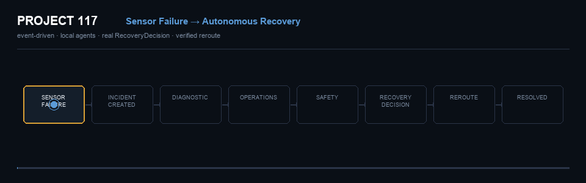
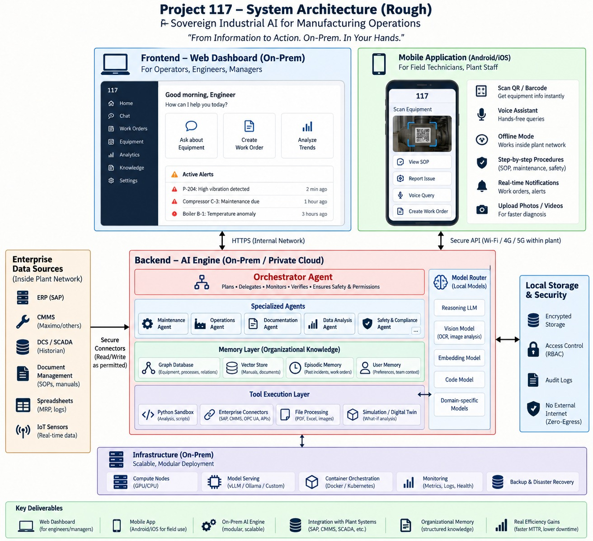
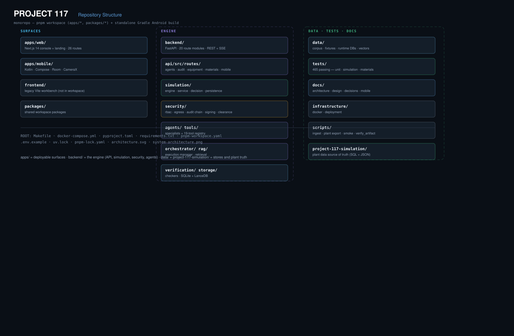

# Project 117

**Sovereign Industrial Intelligence**

> Sovereign on-premise agentic AI workbench for confidential industrial work.



*From confidential information → intelligence → verified industrial action.*

---

## What It Is

Project 117 runs a digital twin of an industrial plant and puts local open-weight models in charge of deciding what to do when it fails. A sensor disappears, the affected section is isolated, three agents reason over real topology and history, and a validated recovery route is executed against the live plant — with every step audited and nothing leaving the machine.

It is not a chatbot over documents, and it is not a dashboard. The unit of output is a **verified decision with an execution path**.

---

## Why Project 117

| Problem | What Project 117 does |
|---|---|
| Plant knowledge is fragmented across SOPs, inspections, work orders and telemetry | Ingests and indexes it locally, then reasons over it with grounded citations |
| Confidential data cannot be sent to external AI APIs | Inference is local; egress is default-deny and enforced in the request path |
| A language model that only answers is not actionable | Agents operate a real tool registry against real plant state |
| "The AI said so" is not auditable | Decisions carry per-agent status, evidence, a tamper-evident audit trail, and signed artifacts |

---

## Core Capabilities

- **Sovereign / on-prem AI** — local open-weight models, default-deny egress, no external model calls
- **Multi-agent reasoning** — three role-specific agents, one model per role
- **Industrial simulation** — refinery digital twin: 58 equipment, 60 connections, 224 sensors
- **Automated recovery** — validated reroute, blocked/restored lines, bounded re-plan
- **Industrial Memory / Knowledge Graph** — topology, documents, work orders, materials, suppliers
- **Multimodal document intelligence** — PDF, DOCX, PPTX, XLSX, scanned PDF, images
- **Permission-aware retrieval** — 5 clearance levels; filtered before the model sees anything
- **Secure tool execution** — 19 permission-gated tools
- **Verification** — envelope, policy, evidence, citation and audit-chain checkers
- **Materials intelligence** — inventory, production, price history, spares, suppliers, financial impact
- **Tamper-evident audit trail** — hash-linked, with an integrity endpoint
- **Ed25519 signed artifacts**
- **Field mobile application** — Android, offline-first

---

## How It Works

```
Confidential Data → Local Processing → Knowledge → Model Router
→ Agents → Tools → Verification → Industrial Action
```

---

## Multi-Agent System

| Agent | Model | Responsibility |
|---|---|---|
| **Diagnostic** | `qwen3:1.7b` | Investigates — reads sensor state, telemetry, maintenance history, topology |
| **Operations** | `llama3.2:3b` | Plans — determines a valid recovery route over the real connection graph |
| **Safety** | `gemma3:1b` | Verifies — validates the route and the recovery decision before execution |

Each publishes its own outcome (`completed` / `rejected` / `failed` / `skipped`), so the console can only report what an agent actually produced. A model that fails to answer stops the recovery rather than being worked around.

---

## Architecture



**Layers:** client surfaces (Next.js console, Android app) → FastAPI application layer with the security middleware chain and 20 route modules → AI layer (orchestrator, specialist agents, model gateway, tool registry, retrieval, verification) → simulation twin → data stores. Everything inside the sovereignty boundary; egress is denied by default.


*Code-level view — every component, port and subsystem as actually implemented.*

---

## Industrial Simulation — From Sensor Failure to Autonomous Recovery


*Real sensor event → real agent reasoning → real recovery decision → real topology change → verified industrial recovery.*

This flow is **event-driven and connected to the live simulation backend**. The console renders what the backend emits over SSE; it does not script the sequence, mock a recovery, or predefine a route.

```
SENSOR FAILURE → SENSOR DISABLED → INCIDENT CREATED
      ↓
AFFECTED EQUIPMENT / PATH IDENTIFIED   (BFS over the real connection graph)
      ↓
FAULTED PATH ISOLATED → AFFECTED CHAMBER TURNS RED → FLOW STOPS
      ↓
THREE LOCAL AGENTS START   (concurrently, one model each)
   ┌────────────────────────────────────────────────┐
   │ DIAGNOSTIC    reads telemetry, history,        │
   │               evidence, topology              │
   ├────────────────────────────────────────────────┤
   │ OPERATIONS    analyses real plant topology,    │
   │               determines an alternative route │
   ├────────────────────────────────────────────────┤
   │ SAFETY        validates evidence, route and    │
   │               the recovery decision           │
   └────────────────────────────────────────────────┘
      ↓
REAL RecoveryDecision    route[]   block[]   restore[]   safety_confirmed   agent_status
      ↓
ROUTE VALIDATION   (ordered topology · no blocked line · in-scope · safety confirmed)
      ↓
ALTERNATIVE PATH ACTIVATED → PROCESS FLOW REROUTED
      ↓
DOWNSTREAM EQUIPMENT RECOVERS → INCIDENT VERIFIED → INCIDENT RESOLVED
```

**Failure handling is honest by design.** If a model is unavailable, or the validator rejects the route, nothing executes: the incident stays open, the affected section stays isolated, and the console names the specific agent that failed. A rejected route is fed back to the same three agents once (`RECOVERY_ATTEMPTS = 2`) before the incident escalates.

**Builder → Plant Definition → Validation → Live Simulation.** The Builder authors a plant definition and saves it; the Live Simulation executes that same real topology — one plant definition, one engine, one renderer. The Builder edits a draft; it never touches the running engine.

---

## Security / Sovereignty

**Verified in this build**

- **Local models** — all inference via local Ollama (`127.0.0.1:11434`)
- **Egress enforcement** — default-deny with an exact-host allowlist (no wildcards), loopback only. Verified: `external_allowed: 0` with real refusals recorded
- **RBAC** — role → permission mapping enforced per route
- **Permission-aware retrieval** — 5 clearance levels (PUBLIC → HIGHLY_CONFIDENTIAL); filtering happens **before** the model context is assembled, and gates direct reads, graph traversal and agent tool calls
- **Network Sentinel** — real ALLOW/BLOCK decisions streamed over SSE and written to the audit log
- **Tamper-evident audit trail** — hash-linked (`sha256(previous_hash ‖ canonical_json(row))`) with an integrity endpoint; direct row mutation and forged inserts are both detected
- **Ed25519 signed artifacts** — sign/verify with tamper detection
- **Controlled tool execution** — 19 permission-gated tools
- **Approvals** — a human gate on consequential actions

**Not yet available — labelled as such in the console, never shown as active**

| Control | Status |
|---|---|
| Sandbox / container network isolation | **Unavailable** — OpenSandbox not running in this environment |
| OS-level egress (nftables / iptables) | **Planned** — Linux-only; the development host is macOS |
| Agent-path OCR / vision | **Planned** — no tool registered yet |
| Prompt-injection refusal | **Planned** — not implemented in the request path |
| Insufficient-evidence abstention | **Planned** |
| Signed artifact from a live end-to-end workflow | **Implemented, not yet exercised** — no artifact signed end to end here |

> The audit chain is tamper-**evident**, not tamper-proof: it detects edits, deletions, inserts and reordering, but is not externally anchored. No air-gap or zero-egress claim is made.

---

## Project Structure



```
project-117/
├── apps/           deployable surfaces — web console, Android app
├── backend/        the engine — API, simulation, security, agents, tools
├── packages/       shared workspace packages
├── database/       schema and migrations
├── infrastructure/ deployment
├── data/           corpus, fixtures, runtime stores
├── tests/          unit · simulation · materials
└── docs/           architecture · design · decisions
```

---

## Tech Stack

| Layer | Stack |
|---|---|
| Console | Next.js 14 (App Router), React 18, TypeScript, Tailwind, Framer Motion |
| Mobile | Kotlin, Jetpack Compose, Room, CameraX, ML Kit, WorkManager, Hilt |
| Backend | Python 3.14, FastAPI, Pydantic v2, Uvicorn |
| AI | Ollama — `qwen3:1.7b`, `llama3.2:3b`, `gemma3:1b` (+ reasoning / coding / domain / embedding roles) |
| Retrieval | LanceDB vectors + lexical BM25 fallback |
| Storage | SQLite (6 stores) + LanceDB |
| Security | Ed25519 (`cryptography`), scrypt password hashing, HMAC-signed session tokens |
| Protocols | REST, Server-Sent Events |

---

## Run Locally

```bash
# Backend — run from the repository root (.env is resolved from the CWD)
python3 -m venv .venv && .venv/bin/pip install -r requirements.txt
cp .env.example .env
.venv/bin/python -m uvicorn backend.api.src.main:create_app \
  --factory --host 0.0.0.0 --port 8000

# Console
pnpm install
pnpm --filter web dev            # http://127.0.0.1:3017

# Local models
ollama pull qwen3:1.7b && ollama pull llama3.2:3b && ollama pull gemma3:1b
```

Requires Python 3.12+, Node 22, pnpm 9+, and Ollama.

---

## Demo Flow

1. **Confidential data** → upload documents in the AI Workbench
2. **Agents** → Diagnostic / Operations / Safety reason over local evidence
3. **Verification** → evidence, route and policy checked before anything executes
4. **Simulation** → `Simulation → Refinery`, take **PT-1001A** out of service
5. **Recovery** → watch the section isolate, the agents decide, the route restore flow
6. **Report** → the incident, its evidence and the decision, with the audit trail

---

## Status

**Verified in this build**

- 465 backend tests passing; `ruff` clean; TypeScript 0 errors; console builds
- Sensor failure → 3 local agents → `RecoveryDecision` → validated reroute → `incident.resolved`, driven end to end
- Audit chain integrity, tamper detection, Ed25519 sign/verify
- Real network ALLOW and BLOCK reaching the sentinel, the audit log and the console
- Clearance filtering proven: an unauthorized caller cannot retrieve restricted evidence
- Android app builds; 7 unit tests passing

**Implemented, not exercised end to end here**

- Signed artifact generation from a live workflow
- Knowledge-graph tool on the agent path (code complete; needs a backend restart to serve)

**Planned**

- Sandbox network isolation (OpenSandbox), OS-level egress (nftables), agent-path OCR/vision, prompt-injection refusal, insufficient-evidence abstention

---

## License

Apache License 2.0 — see [LICENSE](LICENSE).
