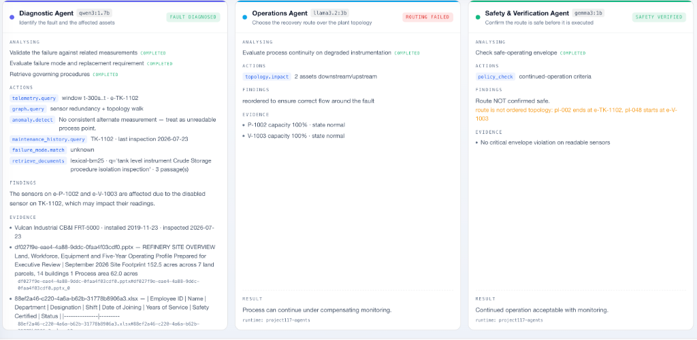
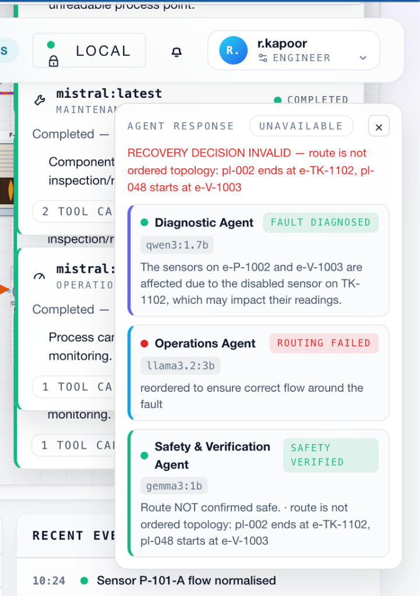
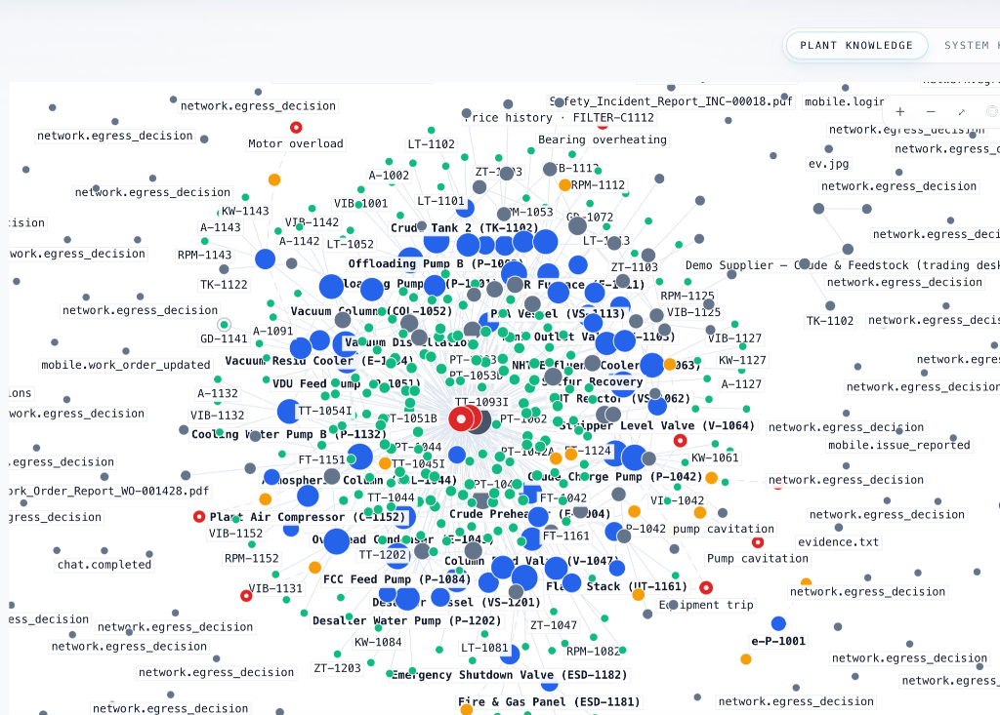
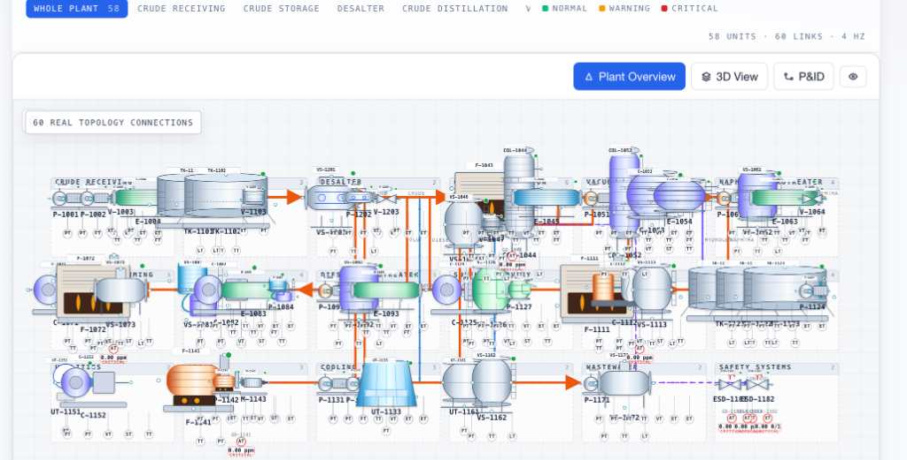

# Project 117

**Sovereign Industrial Intelligence**

> Sovereign on-premise agentic AI workbench for confidential industrial work.

*From confidential information → intelligence → verified industrial action.*

---

## What It Is

Project 117 runs a digital twin of an industrial plant and puts local open-weight models in charge of deciding what to do when it fails. A sensor disappears, the affected section is isolated, three agents reason over real topology and history, and a validated recovery route is executed against the live plant — with every step audited and nothing leaving the machine.

It is not a chatbot over documents, and it is not a dashboard. The unit of output is a **verified decision with an execution path**.

---

## Why Project 117

| Problem | What Project 117 does |
|---|---|
| Plant knowledge is fragmented across SOPs, inspections, work orders and telemetry | Ingests and indexes it locally, then reasons over it with grounded citations |
| Confidential data cannot be sent to external AI APIs | Inference is local; egress is default-deny and enforced in the request path |
| A language model that only answers is not actionable | Agents operate a real tool registry against real plant state |
| "The AI said so" is not auditable | Decisions carry per-agent status, evidence, a tamper-evident audit trail, and signed artifacts |

---

## Core Capabilities

- **Sovereign / on-prem AI** — local open-weight models, default-deny egress, no external model calls
- **Multi-agent reasoning** — three role-specific agents, one model per role
- **Industrial simulation** — refinery digital twin: 58 equipment, 60 connections, 224 sensors
- **Automated recovery** — validated reroute, blocked/restored lines, bounded re-plan
- **Industrial Memory / Knowledge Graph** — topology, documents, work orders, materials, suppliers
- **Multimodal document intelligence** — PDF, DOCX, PPTX, XLSX, scanned PDF, images
- **Permission-aware retrieval** — 5 clearance levels; filtered before the model sees anything
- **Secure tool execution** — 19 permission-gated tools
- **Verification** — envelope, policy, evidence, citation and audit-chain checkers
- **Materials intelligence** — inventory, production, price history, spares, suppliers, financial impact
- **Tamper-evident audit trail** — hash-linked, with an integrity endpoint
- **Ed25519 signed artifacts**
- **Field mobile application** — Android, offline-first

---

## How It Works

```
Confidential Data → Local Processing → Knowledge → Model Router
→ Agents → Tools → Verification → Industrial Action
```

---

---

## Multi-Agent System

| Agent | Model | Responsibility |
|---|---|---|
| **Diagnostic** | `qwen3:1.7b` | Investigates — reads sensor state, telemetry, maintenance history, topology |
| **Operations** | `llama3.2:3b` | Plans — determines a valid recovery route over the real connection graph |
| **Safety** | `gemma3:1b` | Verifies — validates the route and the recovery decision before execution |

Each publishes its own outcome (`completed` / `rejected` / `failed` / `skipped`), so the console can only report what an agent actually produced. A model that fails to answer stops the recovery rather than being worked around.

### Multi-Model Agent Execution & Reasoning



*Heterogeneous local open-weight model reasoning: Diagnostic (`qwen3:1.7b`), Operations (`llama3.2:3b`), and Safety Verification (`gemma3:1b`) collaborate with tool execution traces.*

### Real-Time Recovery Decision & Agent Modal



*Autonomous incident diagnosis, path routing verdict, and safety confirmation emitted to the console in real time.*

---

## Industrial Memory & Plant Knowledge Graph



*Unified plant memory map connecting equipment, instruments, operational events, network decisions, documents, and historical incident tickets.*

---

## Industrial Simulation — Digital Twin & Live P&ID



*Real-time refinery digital twin executing 58 physical equipment units, 224 sensor streams, and 60 validated topological connection lines.*

```
SENSOR FAILURE → SENSOR DISABLED → INCIDENT CREATED
      ↓
AFFECTED EQUIPMENT / PATH IDENTIFIED   (BFS over the real connection graph)
      ↓
FAULTED PATH ISOLATED → AFFECTED CHAMBER TURNS RED → FLOW STOPS
      ↓
THREE LOCAL AGENTS START   (concurrently, one model each)
   ┌────────────────────────────────────────────────┐
   │ DIAGNOSTIC    reads telemetry, history,        │
   │               evidence, topology              │
   ├────────────────────────────────────────────────┤
   │ OPERATIONS    analyses real plant topology,    │
   │               determines an alternative route │
   ├────────────────────────────────────────────────┤
   │ SAFETY        validates evidence, route and    │
   │               the recovery decision           │
   └────────────────────────────────────────────────┘
      ↓
REAL RecoveryDecision    route[]   block[]   restore[]   safety_confirmed   agent_status
      ↓
ROUTE VALIDATION   (ordered topology · no blocked line · in-scope · safety confirmed)
      ↓
ALTERNATIVE PATH ACTIVATED → PROCESS FLOW REROUTED
      ↓
DOWNSTREAM EQUIPMENT RECOVERS → INCIDENT VERIFIED → INCIDENT RESOLVED
```

**Failure handling is honest by design.** If a model is unavailable, or the validator rejects the route, nothing executes: the incident stays open, the affected section stays isolated, and the console names the specific agent that failed. A rejected route is fed back to the same three agents once (`RECOVERY_ATTEMPTS = 2`) before the incident escalates.

**Builder → Plant Definition → Validation → Live Simulation.** The Builder authors a plant definition and saves it; the Live Simulation executes that same real topology — one plant definition, one engine, one renderer. The Builder edits a draft; it never touches the running engine.

---

## Security & Sovereignty Architecture

- **Zero-Egress Enforcement** — default-deny with an exact-host allowlist (no wildcards). Loopback only for local Ollama and OpenSandbox.
- **Multi-Key Role-Based Access Control (RBAC)** — Granular per-key and per-user permission bounds (`P117_AUTH_KEYS`). Roles are strictly bound server-side, neutralizing client header escalation.
- **Multi-Layer Prompt Defense** — `PromptGuard` heuristic/regex pattern filtering combined with `SemanticPromptGuard` model-assisted evaluation for adversarial jailbreak detection.
- **Permission-Aware Retrieval** — 5 clearance levels (`PUBLIC` → `HIGHLY_CONFIDENTIAL`); filtering occurs **before** model context assembly.
- **Tamper-Evident Audit Trail** — Hash-linked cryptographic ledger (`sha256(previous_hash ‖ canonical_json(row))`) with verify endpoints.
- **Ed25519 Signed Deliverables** — Asymmetric signing of plant recovery and workflow artifacts.
- **Container Isolation Security** — Docker-in-Docker socket volume mounts documented with rootless Docker and gVisor isolation recommendations.
- **Database Architecture** — Domain-isolated 6-database SQLite architecture with WAL mode and Alembic migrations. See [DATABASE_ARCHITECTURE.md](docs/DATABASE_ARCHITECTURE.md).

---

## Project Structure

```
project-117/
├── apps/               canonical deployable surfaces — web console (Next.js 14), Android app
│   └── web/            Next.js console with Vitest and Playwright test suites
├── backend/            the engine — FastAPI, simulation, security, agents, tools
├── alembic/            database migration scripts and baseline definitions
├── infrastructure/     deployment & monitoring (Prometheus, Grafana dashboards, Docker)
├── tests/              unit · simulation · materials · eval · load
├── frontend.archived/  historical Vite/React workbench (superseded by apps/web)
└── docs/               architecture · database · performance · setup
```

---

## Tech Stack

| Layer | Stack |
|---|---|
| Console | Next.js 14 (App Router), React 18, TypeScript, Tailwind, Framer Motion, Vitest, Playwright |
| Mobile | Kotlin, Jetpack Compose, Room, CameraX, ML Kit, WorkManager, Hilt |
| Backend | Python 3.11+, FastAPI, Pydantic v2, Uvicorn, Alembic, SQLAlchemy |
| AI / LLM | Ollama multi-provider load balancing — `qwen3:1.7b`, `llama3.2:3b`, `gemma3:1b` |
| Retrieval | LanceDB vectors + lexical BM25 fallback |
| Storage | SQLite (6 domain-isolated stores with WAL mode) + PostgreSQL path |
| Observability | Prometheus metrics (`/api/metrics`) + Grafana pre-provisioned dashboards |
| Scalability | Distributed Redis rate limiting (`P117_REDIS_URL`) & Multi-LLM load balancing |

---

## Run Locally

```bash
# 1. Backend
uv sync
cp .env.example .env
uv run alembic upgrade head
uv run uvicorn backend.api.src.main:create_app --factory --host 127.0.0.1 --port 8000

# 2. Console (apps/web)
pnpm install
pnpm --filter @project-117/web dev      # http://127.0.0.1:3017

# 3. Observability Stack (Prometheus & Grafana)
docker compose -f docker-compose.yml -f infrastructure/monitoring/docker-compose.monitoring.yml up -d

# 4. Local Models
ollama pull qwen3:1.7b && ollama pull llama3.2:3b && ollama pull gemma3:1b
```

---

## Testing & Quality Assurance

```bash
# Backend unit + simulation + materials offline test suite (613 tests)
uv run pytest tests/unit/ tests/simulation/ tests/materials/ -m "not integration"

# Frontend unit & component tests (Vitest)
pnpm --filter @project-117/web test

# Evaluation golden-set harness
uv run pytest tests/eval/ -m eval

# Performance & load testing
uv run locust -f tests/load/locustfile.py --headless -u 25 -r 5 -t 30s --host http://127.0.0.1:8000
```

---

## Demo Flow

1. **Confidential data** → upload documents in the AI Workbench
2. **Agents** → Diagnostic / Operations / Safety reason over local evidence
3. **Verification** → evidence, route and policy checked before anything executes
4. **Simulation** → `Simulation → Refinery`, take **PT-1001A** out of service
5. **Recovery** → watch the section isolate, the agents decide, the route restore flow
6. **Report** → the incident, its evidence and the decision, with the audit trail

---

## Status

**Verified in this build**

- 618 backend tests passing offline (5 integration-marked, run separately); 18 frontend Vitest tests; `ruff` clean; TypeScript 0 errors; console builds
- Sensor failure → 3 local agents → `RecoveryDecision` → validated reroute → `incident.resolved`, driven end to end
- Audit chain integrity, tamper detection, Ed25519 sign/verify
- Real network ALLOW and BLOCK reaching the sentinel, the audit log and the console
- Clearance filtering proven: an unauthorized caller cannot retrieve restricted evidence
- Android app builds; 7 unit tests passing

**Implemented, not exercised end to end here**

- Signed artifact generation from a live workflow
- Knowledge-graph tool on the agent path (code complete; needs a backend restart to serve)

**Planned**

- Sandbox network isolation (OpenSandbox), OS-level egress (nftables), agent-path OCR/vision, prompt-injection refusal, insufficient-evidence abstention

---

## License

Apache License 2.0 — see [LICENSE](LICENSE).
